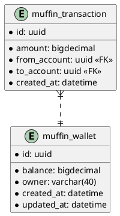

# Muffin wallet

## Database structure

```plantuml
@startuml E/R

entity muffin_wallet {
    * id: uuid
    --
    * balance: bigdecimal
    * owner: varchar(40)
    * created_at: datetime
    * updated_at: datetime
}

entity muffin_transaction {
    * id: uuid
    --
    * amount: bigdecimal
    * from_account: uuid <<FK>>
    * to_account: uuid <<FK>>
    * created_at: datetime
}

muffin_transaction }|..|| muffin_wallet

@enduml
```